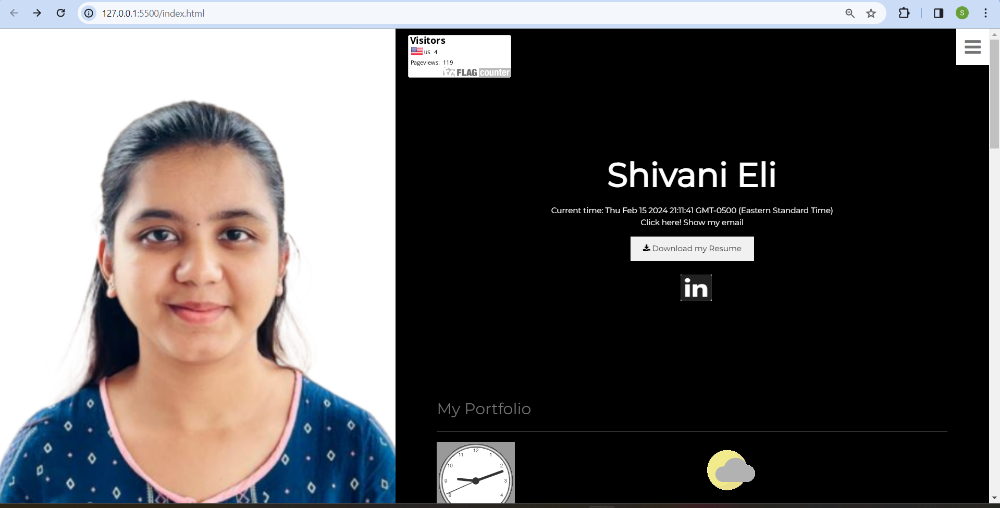
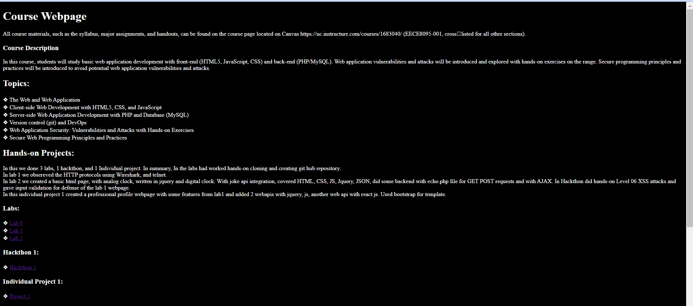
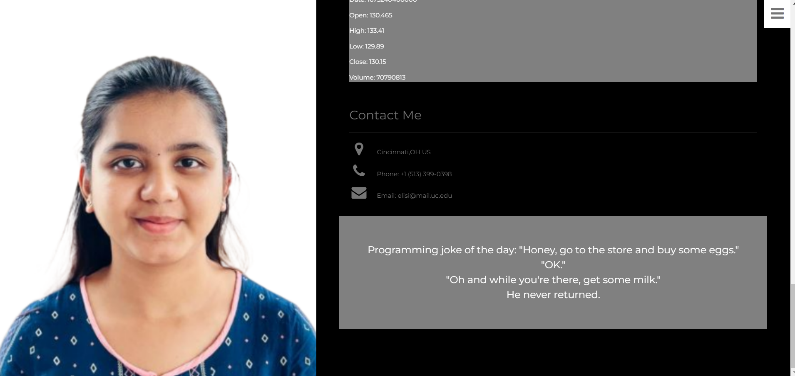
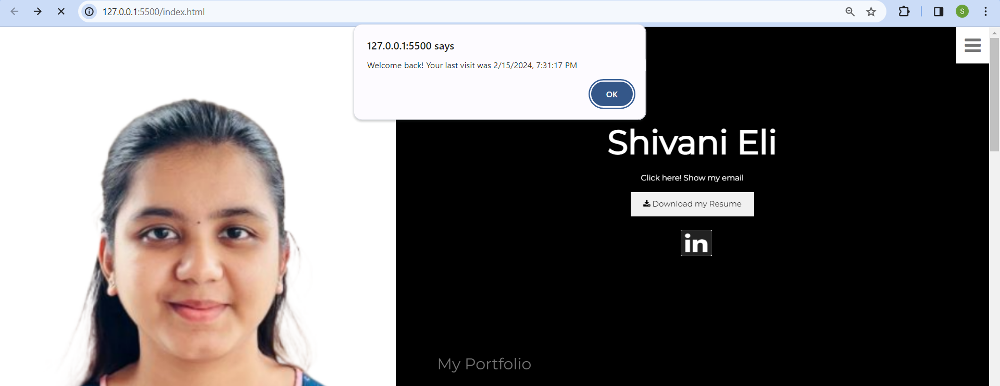
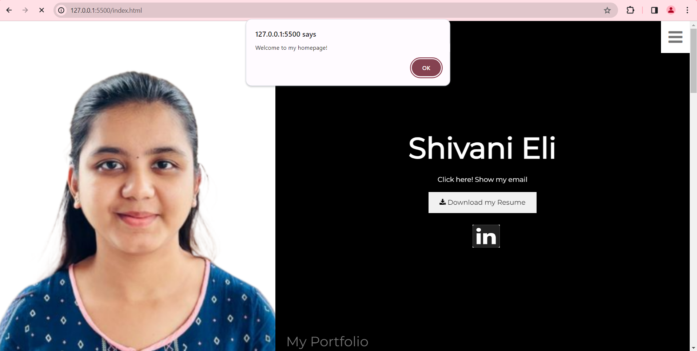

# WAPH-Web Application Programming and Hacking

## Instructor: Dr. Phu Phung

**Name**: Shivani Eli

**Email**: elisi@mail.uc.edu

**Short-bio**: This is Shivani Eli currently pursuing Master's in Information Technology at UC. An IT graduate with a passion for problem solving, and learning new technology to drive innovation.


## Repository Information

Respository's URL: []()

# Individual Project 1 – Front-end Web Development with a Professional Profile Website on github.io cloud service

## Overview and Requirements

In this individual project 1, I have created a professional portfolio webpage. In this webpage, it has my details like, education, work experience, project, contact details, my email. Along with my downloadable resume, I have added few features like, 2D analog clock, digital clock, show/hide email, along with integration of web apis like Joke, weather api. As special feature I have integrated a stock data web api which is developed in a new framework Raect JS, remaining features were added using HTML< CSS< JavaScript, JQuery. The main focus of this project is development of the front-end part with api integration and cookies. I have added a page tracker. I have added linked link, with linked in icon.This all were included in a new public repository.

The link to access my website is: [https://shivanieli.github.io/Project1/index.html](https://shivanieli.github.io/Project1/index.html).

The link to access Individual Project-1 is: [https://github.com/ShivaniEli/ShivaniEli.github.io](https://github.com/ShivaniEli/ShivaniEli.github.io).

## General Requirements

### Personal Website on Github.io

For this website, I have created a new public repository `ShivaniEli.github.io`, where my webpage is available.

The link to access my website is: [https://shivanieli.github.io/Project1/index.html](https://shivanieli.github.io/Project1/index.html).



### "Web Application Programming and Hacking" course and related hands-on projects on waph.html file

Another html file 'waph.html' is created with the web application programming and hacking course details.I created the separate page with the name waph.html on my repository introducing the "Web Application Programming and Hacking" course and its related hands-on projects. In this I includes overviews of Lab0, Lab1, Lab2, Hackathon 1 and Individual Project 1.

The link to access index.html is: [https://shivanieli.github.io/Project1/index.html](https://shivanieli.github.io/Project1/index.html).




## Non-technical requirements

### Bootstrap Template

I have used a bootstrap template free open source template for my portfolio. Then I have made modifications, accordingly, as per the requirements.

### Page Tracker

I have inluded a flag counter, page tracker on the top, for displaying no. of visitors, with website `https://flagcounter.com/`, with the key included within the code.

Code for Flag Counter tracker:

```html
<div style="text-align:left;">
  <a href="https://info.flagcounter.com/szVl"
    ></a>
</div>
```


## Technical requirements

### A digital clock; An analog clock; show/hide your email:

From lab2, added the analog clock, digital clock and show/hide email in the website.

Source Code for digital clock:

```JS
    function displayTime() {
		document.getElementById('digital-clock').innerHTML = "Current time: "+new Date();
	}
	setInterval(displayTime, 500);
	function validateInput(inputId){
		var input=document.getElementById(inputId).value;
		if(input.length==0){
			alert("please enter text");
			return false;
		}
		return true;
	}
	function encodeInput(input){
		const encodeData=document.createElement('div');
		encodeData.innerText=input;
		return encodeData.innerHTML;
	}
    //end digital-clock
```

Source Code for 2D Analog clock:

```JS
var canvas = document.getElementById("analog-clock");
        var ctx = canvas.getContext("2d");
        var radius = canvas.height / 2;
        ctx.translate(radius, radius);
        radius = radius * 0.90;
        setInterval(drawClock, 1000);

        function drawClock() {
            drawFace(ctx, radius);
            drawNumbers(ctx, radius);
            drawTime(ctx, radius);
        }
```

Source Code for show/hide your email:

```JS
var shown = false;

            function showhideEmail() {
                if (shown) {
                    document.getElementById('email').innerHTML = "Show my email.";
                    shown = false;
                }
                else {
                    var mye = "<a href='mailto:elisi" + "@" + "mail.uc.edu'>elisi" + "@" + "mail.uc.edu</a>";
                    document.getElementById('email').innerHTML = mye;
                    shown = true;
                }
            }
```

  


### One more Functionality of my choice

For a new functionality I have added a another web api, stock web api with REACT JS framework. And added a linkedin link with icon. And added a button by clicking it will download my resume, with JS code.For integrating REACTJS I have installed the react-dom, jsx libraries by CND.

Source code for Stock code api:

```JS
<script src="https://cdnjs.cloudflare.com/ajax/libs/react/17.0.2/umd/react.development.js"></script>
                <script src="https://cdnjs.cloudflare.com/ajax/libs/react-dom/17.0.2/umd/react-dom.development.js"></script>

                <!-- Include Babel standalone for JSX transpilation -->
                <script src="https://cdnjs.cloudflare.com/ajax/libs/babel-standalone/6.26.0/babel.min.js"></script>

```

```JS
function StockData() {
                        const [stockData, setStockData] = React.useState(null);
                        const [loading, setLoading] = React.useState(true);

                        React.useEffect(() => {
                            fetch("https://api.polygon.io/v2/aggs/ticker/AAPL/range/1/day/2023-01-09/2023-01-09?apiKey=T6Qj4oY6AG3VP0VGrhmegCHTWB6w4l_6")
                                .then(response => response.json())
                                .then(data => {
                                    setStockData(data);
                                    setLoading(false);
                                })
                                .catch(error => console.log("Error fetching stock data:", error));
                        }, []);

                        return (
                            <div>
                                <h1>Stock Market Data</h1>
                                {loading ? (
                                    <p>Loading...</p>
                                ) : (
                                    <div>
                                        <p>Date: {stockData.results[0].t}</p>
                                        <p>Open: {stockData.results[0].o}</p>
                                        <p>High: {stockData.results[0].h}</p>
                                        <p>Low: {stockData.results[0].l}</p>
                                        <p>Close: {stockData.results[0].c}</p>
                                        <p>Volume: {stockData.results[0].v}</p>
                                    </div>
                                )}
                            </div>
                        );
                    }

                    ReactDOM.render(<StockData />, document.getElementById("stock"));
```

  


### Joke API

From lab2 included the joke api and modified such that new joke is displayed every one minute without reloading the webpage.
Source code for Joke API:

```JS
function getJoke(){
       $.get("https://v2.jokeapi.dev/joke/Programming?type=single", function (result) {
            if (result && result.joke) {
                var encodeJoke = encodeInput(result.joke);
                $("#response").html("Programming joke of the day: " + encodeJoke);
            }
            else {
                $("#response").text("couldnot retrieve a joke at this time. ");
            }

        });

    }
getJoke();
setInterval(getJoke,60000);
```

### Weather API

Inluded a weatherbit API to get current weather of Cincinnati with graphics.

```JS

    $(document).ready(function () {
        var apiKey = '74516cb77ec742629b8fa2c6bead25ad';


        $.get("https://api.weatherbit.io/v2.0/current", {
            key: apiKey,
            city: 'Cincinnati'
        })
            .done(function (data) {

                if (data && data.data && data.data.length > 0) {
                    var weatherData = data.data[0];
                    var temperature = weatherData.temp;
                    var description = weatherData.weather.description;
                    var iconCode = weatherData.weather.icon;


                    var iconUrl = "https://www.weatherbit.io/static/img/icons/" + iconCode + ".png";

                    // Display
                    $("#weather-icon").attr("src", iconUrl);
                    $("#weather-details").html("<p>Temperature: " + temperature + "°C</p>" +
                        "<p>Description: " + description + "</p>");
                } else {
                    $("#weather-info").html("<p>Unable to fetch weather data.</p>");
                }
            })
            .fail(function () {
                $("#weather-info").html("<p>Error occurred while fetching weather data.</p>");
            });
    });

```

  


### Javascript Cookies

Then deployed the cookies javascript code for displaying "Welcome back!" alert message along with last visited date and time if visited the website more than once else alert with "welcome to my home page" message.

```JS
    function setCookie(name, value, days) {
        var expires = "";
        if (days) {
            var date = new Date();
            date.setTime(date.getTime() + (days * 24 * 60 * 60 * 1000));
            expires = "; expires=" + date.toUTCString();
        }
        document.cookie = name + "=" + (value || "") + expires + "; path=/";
    }

    function getCookie(name) {
        var nameEQ = name + "=";
        var ca = document.cookie.split(';');
        for (var i = 0; i < ca.length; i++) {
            var c = ca[i];
            while (c.charAt(0) === ' ') c = c.substring(1, c.length);
            if (c.indexOf(nameEQ) === 0) return c.substring(nameEQ.length, c.length);
        }
        return null;
    }


    function displayWelcomeMessage() {
        var lastVisit = getCookie("lastVisit");
        if (!lastVisit) {
            // First
            setCookie("lastVisit", new Date().toISOString(), 30);
            alert("Welcome to my homepage!");
        } else {
            // Revisit
            var lastVisitDate = new Date(lastVisit);
            alert("Welcome back! Your last visit was " + lastVisitDate.toLocaleString());
        }
    }

    // function call
    window.onload = displayWelcomeMessage;
```



